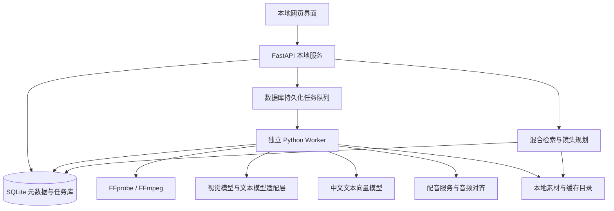

# 自动剪辑软件完整开发计划

- 文档版本：v1.1
- 本次修订：新增上传时填写货号、品类，预置品类与自定义品类管理，并补齐匹配约束及验收。
- 编写日期：2026-09-13
- 项目路线：素材库 + AI 画面理解与文案匹配 + 使用记录 + FFmpeg 自动合成。
- 定位：面向自有短素材库的文案驱动剪辑软件。
- 适用对象：产品负责人、前后端开发、AI 应用开发、测试人员。
- 文档性质：实施计划；文中准确率、性能、成本均为待验证的验收目标，不代表现有系统已经达到。

## 1. 项目目标与范围

### 1.1 已确认需求

1. 用户已有自己的视频素材，单条素材时长在 5 秒以下，原素材无声。
2. 每次由用户提供文案，系统自动选择语义合适的素材并剪成视频。
3. 同一素材不能长期被反复优先使用，需要跨成片记录使用情况并控制重复。
4. 采用自有素材库、AI 匹配、使用记录及 FFmpeg 自动合成的技术路线。
5. 每条素材上传时需要填写基础属性，包括“货号”和“品类”。品类预置“通用”“文胸”“内裤”，后续支持用户新建品类。

### 1.2 为制定计划采用的默认假设

以下是第一版设计基线，必须在阶段 P0 确认；变更后同步调整工期和验收集。

| 项目 | 默认假设 | 变更影响 |
|---|---|---|
| 用户形态 | 单用户、本地部署 | 多用户需要鉴权、租户隔离、共享存储和服务端任务调度 |
| 首发系统 | macOS；Windows 放在后续版本 | Windows 需要单独处理路径、字体、编码器和安装包 |
| 素材规模 | 先以 1,000 条验收，按 10,000 条设计索引和列表 | 超过 10,000 条后依据实测决定数据库、检索方案 |
| 素材内容 | 包含文胸、内裤等商品素材及通用素材；具体拍摄内容在 P0 核实 | 验收集需覆盖不同货号、品类及通用画面，防止跨款误配 |
| 基础属性规则 | 第一版每条素材填写一个货号、选择一个品类；默认两项必填 | 通用素材是否允许无货号、单素材是否涉及多个货号，作为 P0 需确认的业务规则 |
| 成片规格 | 默认 9:16、1080×1920、30 fps、15～90 秒 | 横屏和更长视频增加模板及性能测试 |
| 输出 | MP4，H.264 视频；有音频时使用 AAC | 其他格式单独建立编码兼容性验收 |
| 文案语言 | 简体中文优先 | 其他语言需要字体、断句、配音及对齐测试 |
| 声音 | 支持 AI 配音、导入配音、仅字幕三种模式 | 第一版先接一个配音服务，不开发声音克隆 |
| 背景音乐 | 用户导入拥有使用权的本地音乐 | 自动联网找音乐不属于第一版 |
| 网络 | 原素材本地存储，允许经用户设置后调用云端 AI | 完全离线版本需要单独评估模型和设备性能 |
| 自动化程度 | 可全自动生成，也可先预览分镜、换镜头再导出 | 低置信度匹配和候选不足必须可见 |

### 1.3 第一版必须实现

- 批量导入、去重、缩略图、素材分析、标签修正和内容搜索。
- 上传时逐条或批量填写货号、选择品类；预置通用、文胸、内裤，支持新建品类、后续修正和按属性筛选。
- 文案拆分、配音或字幕时间规划、按画面语义匹配素材。
- 同一成片内不重复、跨成片冷却期、累计使用频次惩罚。
- 多镜头覆盖长句；遵守原素材有效时长，不默认冻结、循环或极端变速。
- 分镜预览、候选镜头替换、锁定镜头、重新生成。
- 字幕、配音、背景音乐、竖屏适配和 MP4 导出。
- 批量任务、失败重试、进度显示、取消、使用记录和备份恢复。

### 1.4 第一版不纳入

- 通用多轨非线性编辑器、复杂关键帧、专业调色和特效市场。
- 自动生成视频画面、数字人、声音克隆。
- 多人协作、云端 SaaS、移动端。
- 自动发布到社交平台。
- 与 ChatCut、剪映、Premiere 的深度集成。

后续确有精修需求时再评估第三方编辑器接口、授权和项目格式，不将未经验证的接口作为第一版依赖。

## 2. 用户操作流程

1. **首次配置**：选择素材库位置、输出位置、AI 服务及可选配音服务；测试连接，查看将发送的数据类型。
2. **导入素材**：选择文件或文件夹，在待导入列表填写货号、选择品类；可对勾选项批量填写，再逐条修改。品类下拉预置“通用”“文胸”“内裤”，支持就地新建品类。校验通过后提交，并查看重复项、属性冲突和异常项。
3. **建立素材库**：后台生成缩略图和画面描述；用户可修改标签、设置禁用或归入相似镜头组。
4. **创建项目**：输入文案，按需要指定目标货号、品类及是否允许通用补充镜头，选择配音模式、画面比例、字幕样式、音乐及重复规则。
5. **生成分镜**：展示每个文案片段、预计时长、选中素材、候选素材、匹配理由和重复提示。
6. **确认或调整**：播放预览、一键更换镜头、锁定镜头；低置信度或素材不足时补素材、改文案或显式放宽规则。
7. **导出视频**：展示真实阶段进度，完成后播放或打开文件位置。
8. **记录使用**：仅成功成片计入使用历史；失败、取消和单纯预览不累计。
9. **批量制作**：导入多条文案，共用模板排队生成；各任务之间也遵守素材重复策略。

## 3. 技术架构与技术栈

### 3.1 总体架构



第一版用浏览器访问本机服务，安装后通过启动器打开页面。API 默认只监听 `127.0.0.1`。素材、数据库、预览和成片均保存在本机；云端 AI 只接收已配置允许发送的抽帧图片或文案。

### 3.2 明确的技术选型

| 层级 | 选型 | 用途及边界 |
|---|---|---|
| 前端 | React + TypeScript + Vite | 素材库、项目表单、分镜预览、任务中心 |
| UI 与样式 | Tailwind CSS + Radix UI | 可复用控件、对话框、键盘访问 |
| 前端数据管理 | TanStack Query；少量本地状态使用 Zustand | 请求缓存、任务刷新、分镜编辑状态 |
| 大列表 | TanStack Virtual | 避免上万条素材同时渲染到 DOM |
| 后端 | Python 3.12 + FastAPI + Pydantic 2 | 项目接口、结构化校验、任务编排 |
| 数据访问 | SQLAlchemy 2 + Alembic | 表结构、事务、可回滚迁移 |
| 数据库 | SQLite，启用 WAL 与外键 | 单用户的项目、素材、任务、使用记录 |
| 后台执行 | 独立 Python Worker + SQLite 任务表 + subprocess | 持久化队列、租约、心跳、取消、FFmpeg 子进程管理 |
| 媒体处理 | FFmpeg + FFprobe，经 P0 选定可分发构建并锁定版本 | 探测、抽帧、裁切、拼接、字幕、音频混合、编码 |
| 画面理解 | 支持多图输入和 JSON 输出的视觉模型；通过适配层接入 | 每条短素材抽多帧，生成画面描述、动作与标签 |
| 文案规划 | 支持结构化输出的文本模型；HTTPX 调用 | 拆分语义片段、提取画面需求；禁止直接生成可执行命令 |
| 语义检索 | `BAAI/bge-m3` 本地文本嵌入，经 sentence-transformers 加载；P0 验证模型许可和设备可用性 | 将素材的中文描述及文案需求映射到向量 |
| 向量存储与计算 | 按模型版本保存向量；NumPy 归一化矩阵点积 | 第一版规模内精确检索，避免先引入向量数据库 |
| 关键词检索 | SQLite FTS5 + 中文分词 | 产品名、动作、场景等关键词补充召回 |
| 配音 | 一个通过 HTTP 接入的中文 TTS 服务，由 P0 实测确定具体供应商 | 优先支持长文本及时间戳；保留供应商替换接口 |
| 配音对齐 | 首选可信词级时间戳；否则采用 whisperX 对齐，P0 验证中文与 macOS CPU 兼容性 | 对音频和原文对齐，不能仅按字数猜配音时间 |
| 字幕 | ASS + FFmpeg libass；附带有分发许可的中文字体 | 第一版提供整句或分行字幕，逐字动效后置 |
| 测试 | pytest、Vitest、Playwright | 后端规则、前端逻辑、完整用户流程 |
| 日志 | Python logging 输出结构化 JSON | 以 job_id / project_id 追踪错误、耗时及调用量 |
| 密钥 | 系统钥匙串，Python keyring 访问 | 数据库只存密钥引用；不把密钥打进前端或日志 |
| 开发环境 | uv、pnpm、Git | 依赖锁定和可复现开发 |
| 首发交付 | 本地 Web 应用 + macOS 启动器；Python 服务可用 PyInstaller 打包 | 安装包必须在未配置开发环境的干净设备验收 |

**供应商与版本冻结规则**：阶段 P0 产出技术选型记录，写明视觉模型、文本模型、TTS 的供应商、具体模型 ID、价格依据、超时、限流和数据策略；把 FFmpeg 构建、前端依赖及 Python 依赖锁定。P0 未通过不得进入完整功能开发。后续更换模型必须跑固定验收集。

**暂不采用 Redis、Celery、PostgreSQL、独立向量数据库**：首版是单用户本地应用，数据库任务队列足够支撑默认一条渲染任务及受限并发分析。若需要多机器 Worker、多用户，或 10,000 条素材下性能目标持续不达标，再按监控结果升级。

### 3.3 模块职责

| 模块 | 输入 | 输出 | 必须遵守的边界 |
|---|---|---|---|
| 素材管理 | 本地视频 | 标准元数据、有效时段、缩略图 | 不覆盖或删除原始素材 |
| 素材分析 | 多帧图片、元数据 | 描述、标签、质量标记、向量 | 无依据的画面内容标为不确定 |
| 文案规划 | 文案、配音、目标规格 | 语义片段与时间区间 | 不擅自改写用户原文；改写须单独启用 |
| 候选检索 | 画面需求、素材库 | 相关候选和分数 | 禁用、损坏、缺失素材不可入选 |
| 镜头调度 | 候选、时长、重复规则 | 分镜与素材预留 | 硬约束由确定性代码检查 |
| 合成引擎 | 已校验的时间线 JSON | 预览、MP4、导出报告 | 不接受模型提供的 shell 命令 |
| 使用统计 | 成功成片记录 | 素材及相似组使用历史 | 幂等写入，重复重试不重复累计 |

## 4. 素材分析与匹配方案

### 4.1 入库和去重

上传表单先收集并校验货号与品类，以下步骤使用已绑定逐文件属性的导入清单执行；具体规则见 4.6。

1. 使用 FFprobe 获取时长、尺寸、帧率、编码、旋转信息和音轨。
2. 对文件计算 SHA-256，完全相同的文件只建立一份素材实体，保留来源路径映射。
3. 默认复制到托管素材目录；支持引用原路径，但必须提示移动文件会导致失联，并提供重新定位功能。
4. 验证可解码性；零字节、无视频轨、损坏文件进入异常列表。
5. 超过 5 秒的素材标记为不符合当前素材规格，由用户选择排除或另行处理，不静默截断。
6. 对正常短素材默认在有效时长的 10%、50%、90% 抽帧；极短片段按实际可解码帧数去重抽取。
7. 黑帧、片头片尾异常按阈值标记，并记录可用时段；有效时段不足镜头要求时不选用。
8. 相似组综合多帧感知哈希、描述及人工修正产生，不凭一张相似截图永久合并。

### 4.2 素材分析结构

```json
{
  "asset_id": "uuid",
  "description": "一个人在办公室电脑前打字，镜头从侧面拍摄",
  "subjects": ["人物", "电脑"],
  "actions": ["打字", "办公"],
  "scene": ["办公室", "室内"],
  "mood": ["忙碌"],
  "shot_scale": "中景",
  "camera_motion": "固定",
  "visible_text": [],
  "quality_flags": [],
  "uncertain_fields": [],
  "usable_start_ms": 0,
  "usable_end_ms": 3600,
  "analysis_version": "vision-model-id:prompt-v1"
}
```

画面客观信息与情绪联想分别保存。模型自报置信度仅作参考，不能直接当作准确率；低置信度阈值须用标注集校准。人工修改字段优先于自动字段，重分析不得覆盖人工修正。

### 4.3 文案与时长规划

- 按语义拆分文案，保留原文字符位置及标点；一段含多个画面意图时进一步拆分。
- 生成或导入配音后，用真实音频时长和对齐结果确定片段时间。
- 仅字幕模式按可配置阅读速度估时，并在界面明确标记“预计时长”。
- 默认镜头长度偏好为 1.5～4 秒，属于可配置偏好，不是强制范围；原片不足 1.5 秒时可选择排除或允许短镜头。
- 一个 8 秒文案片段可以分配多个短镜头；相邻镜头兼顾人物、场景、动作和视觉连续性。
- 如果配音长度超出目标时长容差，明确提示调整文案、配音语速或目标时长，不截断句子。
- 第一版默认硬切，不默认循环、冻结或改变素材速度；转场作为后续可选功能。

### 4.4 混合检索和最终选择

1. 结构化过滤：先按用户确认的目标货号、品类及通用镜头策略筛选，再排除禁用、损坏、缺失、基础属性未补齐、不可用时长不足的素材。具体属性规则见 4.6；AI 语义高分不能绕过货号和品类约束。
2. 向量召回：按画面需求检索描述向量，默认取前 30 条。
3. 关键词补充：用 FTS5 检索具体物体、产品名、动作，与向量结果合并去重。
4. 相关性重排：基于画面意图、实体、动作和场景排序，必要时让模型仅对候选 ID 重排。
5. 全片调度：跨文案片段联合分配候选，满足总时长、唯一性和冷却约束；第一版用有界候选搜索或回溯，避免逐句贪心导致后半段无素材。
6. 输出解释：说明画面对应文案的依据、使用历史和规则排除原因。

初始软评分可定义为：

```text
综合分 = 语义相关分 × 0.55
       + 动作与实体匹配分 × 0.20
       + 画面质量分 × 0.10
       + 画面衔接分 × 0.10
       + 少用优先分 × 0.05
```

各分项先归一化；权重是 P4 调优起点，不是预设最优值。必须先满足相关性最低门槛，再用少用优先分打破相近候选的排序。不能为了减少重复而选择明显无关画面。

### 4.5 重复控制规则

| 规则 | 默认值 | 属性 | 候选不足时的处理 |
|---|---|---|---|
| 同一成片内重复文件 | 禁止 | 硬约束 | 暂停自动出片并报告缺口 |
| 同一成片内相似组重复 | 禁止，用户可按项目调整 | 硬约束 | 请求调整该项目规则或补充素材 |
| 最近成片冷却 | 最近 5 条成功生成的不同成片中用过的素材暂不使用 | 默认硬约束 | 不静默放宽；用户显式允许后记录例外 |
| 相似组跨成片冷却 | 可选开启 | 可配置硬约束 | 同上 |
| 累计使用频次 | 同等相关性下，少用的优先 | 软约束 | 不牺牲相关性门槛 |
| 连续开头相似 | 尽量避免相邻成片使用同组开头 | 软约束 | 在候选允许时重排 |
| 用户指定素材 | 显示与规则的冲突 | 显式例外 | 确认后保存例外原因，不能悄悄绕过 |

冷却期按成功成片的单调序号判断，不按文件修改时间；重新下载、重新编码同一剪辑版本不产生新的冷却序号。删除导出文件不删除历史。更换镜头形成新的剪辑版本，成功生成后才作为新的成片计数。

批量任务采取“按顺序规划并预留”的方式。已有任务的预留也参与冲突检查，避免多个任务同时选中一批素材。默认约束可比仅检查成功历史更保守，必须在界面说明等待中的预留冲突；任务失败或取消后释放预留。

需要提供可复现随机种子，允许在相关性接近的候选中生成多个版本；同输入、素材库快照、模型结果缓存、规则和种子应产生相同时间线。

### 4.6 上传基础属性与品类管理

#### 4.6.1 字段规则

| 字段 | 类型和填写方式 | 第一版规则 | 验收标准 |
|---|---|---|---|
| 货号 | 文本输入，字段 `sku` | 默认必填；去除首尾空格后为 1～64 个字符，保留前导零、字母大小写和连字符，不转数字；多条素材可以对应同一货号 | `00123` 和 `AB-001` 保存、查询及重新打开后不变；空值和超长值前后端均拒绝 |
| 品类 | 下拉单选，字段 `category_id` | 必选；预置“通用”“文胸”“内裤”；显示名称、存储稳定 ID | 初始化后恰有三个预置品类；新建品类即时可选；不存在或已停用 ID 不可用于新上传 |
| 自定义品类名 | 文本输入 | 去除首尾空格后为 1～30 个字符；全库按统一规范化键去重，禁止空名称 | 重复名称给出明确提示；前后端规范化一致；并发创建同名品类最多成功一条 |

货号用于识别业务商品，不作为文件去重键；文件去重仍使用 SHA-256。货号与品类由用户填写，AI 可以提供建议但不得自动覆盖。第一版不额外开发完整商品档案、库存或 SKU 管理系统。

“一个素材一个货号、一个品类”和“货号默认必填”是本计划的实施默认值，并非已经确认的完整业务限制。P0 需确认通用素材能否无货号、同一画面能否包含多个款式；若调整，须同时修改字段约束及验收用例。不可用伪造货号填充未知值。

#### 4.6.2 上传、批量填写与后续修改

1. 上传清单每行显示缩略图、文件名、货号和品类；品类初始不代选，避免把忘记填写误当成“通用”。
2. 提供“应用到全部”与“应用到勾选项”，执行前明确覆盖范围；单行修改仅影响该行。
3. 每个文件使用稳定的导入项 ID 绑定属性，不能仅按文件名绑定，避免不同目录下同名文件串值。
4. 填写错误时保留已填内容、定位错误行；仅对校验通过且明确提交的行创建正式导入任务。
5. 品类下拉提供“新建品类”，创建成功后自动选中该品类，返回原清单时已填写内容不丢失。
6. 重复文件若货号或品类不一致，展示已有值与本次值，进入待处理状态；用户选择沿用已有属性或显式修改原素材属性，不静默覆盖，也不复制实体绕过去重。
7. 素材详情与批量操作支持修改货号、品类，保存前列出变更范围，并记录旧值、新值及时间。
8. 属性修改立即刷新筛选与匹配缓存，不需要重新调用视觉模型。已有分镜保留当时的属性快照；尚未导出的分镜在导出前按当前属性重验，冲突时提示重新规划，不默默换镜头。
9. 若以后已有旧素材缺少字段，迁移时标记为“待补齐属性”，允许浏览和编辑，禁止自动参与新匹配；不默认归入“通用”。

#### 4.6.3 品类生命周期

- 品类使用独立数据库表管理，不能把三个预置选项写死为前端枚举；新建品类不需要修改代码或重启。
- 预置品类带稳定系统标识，“通用”的补充镜头语义根据系统标识判断，不能根据名称模糊判断。
- 第一版保留三个预置品类名称，不允许删除或停用；自定义品类支持重命名、停用和恢复。
- 自定义品类被引用后不物理删除；停用只禁止新上传选择，不让已有素材失联。已有素材仍可浏览、筛选及被原规则匹配；若不希望入选，应禁用素材或迁移到其他品类。
- 重命名保持 ID 不变，素材关联继续有效；历史成片同时保留当时名称快照。

#### 4.6.4 属性参与选素材的规则

| 项目场景 | 候选规则 | 不足时的行为 |
|---|---|---|
| 指定货号 `AB-001` | 商品展示镜头必须来自 `AB-001`；若同时指定品类，还必须满足该品类 | 提示该货号可用素材不足，不自动切换到 `AB-002` |
| 只指定“文胸”等品类 | 商品展示镜头限定该品类，仍按文案语义和重复规则排序 | 不自动使用“内裤”等其他品类素材 |
| 启用“允许通用补充镜头” | 对不涉及具体商品外观、功能证据的过渡或场景片段，可加入“通用”候选，并标明例外依据 | 通用不等于万能匹配，仍需通过相关性门槛；默认关闭此开关 |
| 未指定货号和品类 | 全库语义匹配；文案出现明确货号或产品品类时提出建议并等待用户确认约束 | 明显对象冲突仍不得入选；混合品类需求先按片段确认约束 |
| 有属性约束且素材在冷却期 | 属性条件与冷却条件同时生效 | 显式放宽冷却仅改变重复策略，不能顺带放宽货号或品类 |

项目或片段的目标货号、品类及通用补充策略保存到配置快照，候选列表展示素材货号、品类以及被排除原因。现有语义匹配与重复控制规则仍在属性筛选后的候选集内执行。

## 5. 数据模型与状态管理

### 5.1 核心表

| 表 | 关键字段 | 说明 |
|---|---|---|
| assets | id、sha256、sku、category_id、metadata_status、metadata_version、managed_path、duration_ms、fps_num、fps_den、width、height、status、similar_group_id | sha256 唯一；sku 为文本且不唯一，保留前导零；category_id 外键；建立 sku、category_id 及组合索引；软删除与禁用分开 |
| categories | id、name、name_key、system_code、is_builtin、is_active、created_at、updated_at | name_key 唯一；三个预置项幂等初始化；稳定 ID 关联素材 |
| asset_metadata_changes | asset_id、old_values_json、new_values_json、changed_at | 记录货号与品类修改，不覆盖成片历史快照 |
| import_items | id、job_id、source_path、sku、category_id、status、error_code | 每个导入项独立绑定属性；重复文件属性冲突可恢复处理 |
| asset_sources | asset_id、source_path、last_seen_at | 重复导入来源、引用失联和重新定位 |
| asset_analysis | asset_id、model_id、prompt_version、description、tags_json、manual_overrides、status | 分析版本及人工修正 |
| asset_vectors | asset_id、embedding_model、dimension、vector_path、index_version | 可重建；向量文件和索引版本对应 |
| similar_groups | id、reason、review_status | 相似镜头归组及人工拆组 |
| projects | id、name、script、config_json、created_at | 项目原文和配置 |
| script_segments | id、project_id、text、source_start、source_end、start_ms、end_ms | 原文映射及实际配音时间 |
| edit_revisions | id、project_id、revision、seed、library_snapshot、status | 一次可独立生成的剪辑版本 |
| shots | revision_id、segment_id、asset_id、asset_metadata_snapshot、source_in_ms、source_out_ms、timeline_start_ms、timeline_end_ms、locked | 素材区间与成片区间；属性快照包含当时货号、品类 ID/名称及元数据版本 |
| reservations | revision_id、asset_id、group_id、expires_at、lease_owner | 规划及导出阶段的临时占用 |
| renders | id、revision_id、profile、output_path、checksum、status | 同一剪辑版本可有多个技术导出 |
| usage_events | revision_id、asset_id、group_id_at_use、committed_at、success_sequence | revision_id + asset_id 唯一，记录当时相似组 |
| jobs | id、type、state、stage、progress、attempt、lease_owner、lease_until、heartbeat_at、error_code | 持久化任务队列 |
| job_steps | job_id、step_key、cache_key、status、artifact_path | 阶段恢复、缓存验证 |
| provider_calls | job_id、provider、model、usage_json、estimated_cost、currency、status | 调用量、费用与失败记录；不保存密钥 |
| settings | key、value_json | 模板、目录、重复规则及密钥引用 |

### 5.2 任务状态

```text
queued → running → succeeded
                 → failed → queued（重试）
                 → cancelling → cancelled
                 → needs_input → queued（补充信息后继续）
```

- Worker 使用原子事务领取任务，通过租约和心跳识别失联任务。
- 默认单渲染并发；AI 分析并发受供应商限流、机器资源及配置共同限制。
- 暂停或崩溃不等于成功；进度和恢复点从数据库及产物校验取得。
- 超时租约经核查后回收，不能把仍运行的 Worker 误判为失联而双重执行。

### 5.3 成功导出与使用记录的一致性

文件系统与 SQLite 不共享事务，必须设计恢复协议：

1. 输出到该任务独立临时目录。
2. 检查文件可解码、音视频时长、尺寸、帧率及预期产物信息。
3. 写入导出清单，包含剪辑版本、校验和、最终路径和所用素材。
4. 在同一文件系统内原子改名为正式产物。
5. 数据库事务中写入 render 成功、幂等 usage_events、成功序号，并释放预留。
6. 应用启动时核对“有正式文件但数据库未提交”等中断状态，凭清单补交或标记修复，不重复记账。

同一剪辑版本的失败重试、再次下载及不同码率导出只记一次素材使用；镜头改动后产生新版本，成功导出后另记一次。

## 6. 接口与工程目录

### 6.1 第一版接口契约

| 接口 | 用途 | 关键验收点 |
|---|---|---|
| `POST /api/assets/import` | 按逐文件属性清单创建导入任务 | 每项含导入项 ID、文件来源、sku、category_id；逐项校验必填字段和品类状态；返回 job_id；幂等键防止重复任务 |
| `GET /api/assets` | 分页、筛选、检索 | 支持货号精确筛选、货号文本搜索、品类、标签、状态及使用次数筛选；匹配约束只使用货号精确值 |
| `PATCH /api/assets/{id}` | 修改货号、品类、标签、禁用和分组 | 版本冲突检测；修正后索引及匹配缓存更新，保留修改记录 |
| `PATCH /api/assets/batch` | 批量修改基础属性 | 明确素材 ID 列表及预期版本；整批先校验，冲突时不部分覆盖，返回错误项 |
| `GET /api/categories` | 获取预置和自定义品类 | 上传默认列出启用品类；管理页可包含停用品类 |
| `POST /api/categories` | 新建品类 | 后端规范化与唯一约束，重复返回 409；创建后即时可选 |
| `PATCH /api/categories/{id}` | 重命名、停用或恢复自定义品类 | 保持 ID 和素材关联；禁止修改受保护的预置项 |
| `POST /api/projects` | 保存文案与配置 | 非法时长、空文案、未配置服务返回可理解错误 |
| `POST /api/projects/{id}/plan` | 配音、匹配、生成分镜 | 异步返回 job_id；记录配置快照 |
| `GET /api/projects/{id}/storyboard` | 获取当前分镜 | 包含版本号、候选、理由、时间和警告 |
| `PATCH /api/projects/{id}/storyboard` | 替换、锁定、调整 | 基于版本号进行并发冲突检查，服务端重验约束 |
| `POST /api/projects/{id}/render` | 导出当前版本 | 幂等；先验证素材有效、当前货号/品类满足版本约束及预留状态 |
| `POST /api/batches` | 导入多文案批量任务 | 指定模板、顺序、例外策略和成本上限 |
| `GET /api/jobs/{id}` | 任务状态 | 返回阶段、已完成数及错误码 |
| `GET /api/jobs/{id}/events` | SSE 进度 | 断线可恢复；轮询作为回退 |
| `POST /api/jobs/{id}/cancel` | 取消任务 | 终止子进程、释放预留、不写使用记录 |
| `GET /api/usage` | 使用历史与统计 | 可追踪至成片及剪辑版本 |
| `POST /api/system/backup` | 备份数据库和配置 | 通过 SQLite 在线备份接口获得一致性快照 |

### 6.2 推荐目录

```text
project/
  frontend/
    src/pages/                 # 素材库、上传属性表单、品类管理、项目、分镜、任务、设置
    src/components/
    src/api/
  backend/
    app/api/
    app/models/
    app/services/ingest/
    app/services/analysis/
    app/services/retrieval/
    app/services/planning/
    app/services/rendering/
    app/services/usage/
    app/providers/             # 视觉、文本、配音适配器
    app/workers/
    migrations/
    tests/
  tests/e2e/
  tests/fixtures/
  evals/                       # 固定标注集、运行脚本、指标报告
  scripts/                     # 环境检查、启动、打包
  docs/
  data/                        # 运行数据；不提交 Git
    library/
    thumbnails/
    vectors/
    audio/
    previews/
    exports/
    temp/
    backups/
```

## 7. 分阶段开发计划及验收标准

### P0：需求冻结与关键技术验证

**建议工期：4～6 个工作日。依赖：用户提供有代表性的素材和文案。**

| 编号 | 开发任务 | 交付物 | 验收标准与方法 |
|---|---|---|---|
| P0-01 | 确认素材领域、数量、日出片量、成片规格、配音、联网及货号/品类业务规则 | 签字或记录确认的需求清单 | 1.2 中所有假设有确认结果；未确认项有明确默认值及影响，无未决阻塞项 |
| P0-02 | 建立真实样本集 | ≥200 条素材、≥20 条文案、≥100 个画面需求单元 | 覆盖文胸、内裤、通用、自建品类、多货号、近似镜头、稀缺场景、抽象文案、短镜头及异常文件；每个需求有人审相关候选 |
| P0-03 | 划分调优与保留验收集 | 约 70% 调优、30% 保留集及版本清单 | 近重复素材按组划分；不使用保留集调权重；人工标注分歧经负责人裁定 |
| P0-04 | 对比至少两个可用视觉模型配置 | 准确率、延迟、费用、数据说明对比 | 在 50 条素材上，核心主体/动作/场景准确率 ≥85%；严重臆造率 ≤5%；结果经过 JSON 校验 |
| P0-05 | 验证中文配音与对齐链路 | 配音、字幕时间轴、对齐报告 | 10 段含数字、英文词和标点的文案可生成并对齐；失败能定位；明确中文、CPU 环境可用 |
| P0-06 | 验证媒体工具及目标机器 | 一段 30 秒竖屏样片、机器记录 | 可拼接、烧录中文字幕、混音及导出；FFmpeg 构建具有所需编码器和 libass；模型能在目标设备加载 |
| P0-07 | 冻结方案、服务版本和预算 | 技术决策记录、风险清单、验收预算表 | 所有供应商 ID、依赖版本、分发许可、每千素材分析预算和每条成片预算均有记录 |

**阶段退出条件**：画面理解、配音对齐、合成三项技术验证通过。若未通过，应先换模型或缩小范围，不进入完整开发。

### P1：工程骨架、数据库与任务框架

**建议工期：4～6 个工作日。依赖：P0。**

| 编号 | 开发任务 | 交付物 | 验收标准与方法 |
|---|---|---|---|
| P1-01 | 建立前后端项目、依赖锁定和启动脚本 | 可运行的空应用 | 新开发环境按 README 可启动；首页及健康检查成功；无需修改源代码 |
| P1-02 | 创建核心数据库与迁移 | Schema、迁移脚本 | 空库可升级；测试库升级保留数据；外键、唯一键生效；备份后可恢复 |
| P1-03 | 实现持久化任务队列、Worker 租约及心跳 | 队列与任务接口 | 模拟 20 个任务不会丢失或重复领取；强杀 Worker 后可回收过期任务 |
| P1-04 | 实现模型适配器与结构化校验 | 统一接口、错误码 | 服务超时、429、认证失败、无效 JSON 各有明确分支；重试次数有上限 |
| P1-05 | 实现设置、密钥管理及日志 | 设置页、日志脱敏规则 | 密钥不进入前端包、数据库正文及日志；无密钥时界面提示配置；本地服务校验来源及会话令牌 |

**阶段退出条件**：应用可启动，任务可恢复，数据库迁移与配置方式稳定。

### P2：素材库、导入与画面分析

**建议工期：9～13 个工作日。依赖：P1。**

| 编号 | 开发任务 | 交付物 | 验收标准与方法 |
|---|---|---|---|
| P2-01 | 批量导入与媒体探测 | 导入页、导入报告 | 1,000 条正常素材全部有结果；损坏和零字节文件逐项报告，不导致批任务中断 |
| P2-02 | 文件去重与路径管理 | 哈希去重、引用重新定位 | 同一批重复导入不新增素材实体；不同文件名的相同文件能识别；移动引用文件显示失联 |
| P2-03 | 抽帧、缩略图、有效时段判断 | 缩略图与质量标记 | 旋转视频、可变帧率和极短素材抽帧正常；抽帧不越界；缺帧可重试或报告 |
| P2-04 | 视觉分析与增量缓存 | 结构化分析库 | 同文件、模型、提示版本下再次导入不重复付费分析；失败条目可单独重试；模型换版可选择重分析 |
| P2-05 | 标签编辑、禁用和相似组管理 | 素材详情页 | 人工修正重启后保留；重新分析不覆盖修正；禁用立即影响候选；相似组可合并及拆分 |
| P2-06 | 分页、虚拟列表和筛选 | 素材库页面 | 10,000 条元数据列表正常滚动；1,000 条库下列表查询 p95 ≤500ms；后台分析时页面可操作 |
| P2-07 | 单条使用次数和历史入口 | 素材使用视图 | 使用次数可从事件重算，与统计展示一致；暂无成片时显示 0 |
| P2-08 | 上传货号、品类与批量填写 | 逐文件属性表单及服务端校验 | 空字段无法提交；100 条素材批量填写后逐条改 10 条，保存结果与清单完全一致；同名不同文件不串值；前导零保留 |
| P2-09 | 预置品类与自定义管理 | 品类表、管理页及接口 | 首次启动有通用、文胸、内裤；重复启动不重复初始化；新建后无需重启可选；重名拒绝；重命名和停用不破坏已有引用 |
| P2-10 | 属性修正、重复导入冲突及迁移 | 批量编辑、审计、属性补齐流程 | 重复文件属性不同不静默覆盖；修改不重新付费分析；属性不全不参与自动匹配；备份恢复保留货号、品类及变更记录 |

**阶段退出条件**：真实素材能稳定入库、分析、修正及查询，异常可解释且可恢复。

### P3：文案处理、配音与时间轴规划

**建议工期：5～7 个工作日。依赖：P2。**

| 编号 | 开发任务 | 交付物 | 验收标准与方法 |
|---|---|---|---|
| P3-01 | 项目创建与文案拆分 | 项目页、语义片段 | 固定 20 条文案无漏句、重复句、擅自改写；每段能映射回原文 |
| P3-02 | AI 配音与导入配音 | 音频生成及导入模块 | 三种模式均可保存；重复生成相同参数可复用缓存；配音服务失败不清空项目 |
| P3-03 | 配音与原文对齐 | 时间标记、可视校正入口 | 至少 100 个人工核对语句边界，误差 p95 ≤200ms；未通过的片段明确提示人工调整 |
| P3-04 | 仅字幕时长、长句多镜头需求 | 时间规划 JSON | 8 秒句子可规划多个短镜头；不超过素材能力；15～90 秒项目均可得到明确时长或冲突原因 |
| P3-05 | 时长冲突与语速约束 | 校验及提示 | 配音超过目标时长容差（默认 ±5%）时进入待处理状态，不截断、静默加速或填入无效时间 |

**阶段退出条件**：每个文案片段有可信时间区间，三种声音模式均有可执行的时间规划。

### P4：语义匹配、全片调度和重复控制

**建议工期：9～12 个工作日。依赖：P2、P3。**

| 编号 | 开发任务 | 交付物 | 验收标准与方法 |
|---|---|---|---|
| P4-01 | 中文向量索引与关键词召回 | 可重建索引、检索接口 | 保留验收集上候选 Top-5 命中率 ≥85%；新入库和人工标签更新可被检索到 |
| P4-02 | 相关性重排、最低门槛与理由 | 候选列表和匹配解释 | 最终镜头人工语义合格率 ≥80%；不能解释的推断标为不确定；候选素材 ID 必须真实存在 |
| P4-03 | 全片镜头调度 | 分镜时间线 | 为每句覆盖所需时长，无负区间、源素材越界或时间空洞；稀缺候选测试不因简单贪心误报无解 |
| P4-04 | 同片及跨片重复规则 | 约束校验器 | 在素材充足的固定样本中连续生成 20 条成片计划，硬约束违规次数为 0 |
| P4-05 | 频次惩罚和相似组控制 | 权重配置、相似组规则 | 使用等相关性的专用样本测试：连续 100 次选择后素材使用次数最大差值 ≤2；真实样本仍满足语义门槛 |
| P4-06 | 候选不足及规则例外 | 缺口报告、显式放宽流程 | 每次失败能指出缺哪类画面、受何规则限制；放宽前后有记录；不自动使用无关素材填满 |
| P4-07 | 批量预留与幂等 | 预留事务、版本及种子 | 同时提交 5 个规划任务不会争抢受限素材；取消释放预留；相同快照与缓存、种子产生相同时间线 |
| P4-08 | 货号、品类筛选与通用补充策略 | 项目/片段约束、候选解释、导出前重验 | 在 ≥30 个包含近似商品及跨品类诱导候选的标注用例中，错误货号和品类入选次数为 0；通用只用于显式启用且符合语义的片段；属性改动冲突能阻止错误导出 |

**阶段退出条件**：匹配质量达标，重复硬约束零违规，素材不足能透明处理。

### P5：FFmpeg 合成、字幕与音频

**建议工期：7～10 个工作日。依赖：P3、P4。**

| 编号 | 开发任务 | 交付物 | 验收标准与方法 |
|---|---|---|---|
| P5-01 | 定义统一时间线及服务端校验 | JSON Schema、渲染编译器 | 非法文件、负时长、区间越界、不可用素材进入合成前即拒绝；只生成参数数组，不拼接 shell |
| P5-02 | 标准化帧率、尺寸、旋转及像素格式 | 视频合成模块 | 横竖屏混合、24/25/30/60 fps 和可变帧率样本可输出规格一致的 MP4，无镜头倒转和拉伸 |
| P5-03 | 竖屏裁切、留边与裁切预览 | 构图配置 | 用户可选居中裁切或完整画面留边；预览与导出一致；主体被裁切时可人工改偏移 |
| P5-04 | 中文字幕排版 | ASS 模板、字体资源 | 中英文、数字、长句、标点均无乱码和超安全区；1080×1920 默认左右 ≥64px、底部 ≥240px，可改模板 |
| P5-05 | 配音、背景音乐与响度 | 混音模块 | 无削波，真峰值 ≤-1 dBTP；有配音时默认约 -16 LUFS、容差 ±2 LU；音乐可调低或自动闪避 |
| P5-06 | 低清预览和正式导出 | 540×960 预览、1080×1920 成片 | 正式片可在系统播放器及浏览器播放；合成时长与时间线差 ≤1 帧，视频与音频结尾差 ≤100ms |
| P5-07 | 产物校验和使用记账 | 清单、成功提交、恢复流程 | 导出成功仅记账一次；模拟改名前、改名后、数据库提交前崩溃，恢复后无虚增、漏记或重复记账 |
| P5-08 | 取消及故障处理 | 子进程控制与错误提示 | 取消后 5 秒内停止对应 FFmpeg 进程；磁盘不足、素材丢失、编码失败不生成假成功状态 |

**阶段退出条件**：能够从文案和选定镜头生成合格成片，导出与使用历史保持一致。

### P6：完整交互与批量生产

**建议工期：6～9 个工作日。依赖：P5。**

| 编号 | 开发任务 | 交付物 | 验收标准与方法 |
|---|---|---|---|
| P6-01 | 分镜编辑界面 | 句子、镜头、候选及理由卡片 | 能播放镜头、选替代项、查看历史、修正裁切；替换后时间线和预览更新 |
| P6-02 | 锁定和局部重生成 | 镜头锁定机制 | 锁定镜头不因其他句子重生成被替换；锁定与规则冲突时提示，不能覆盖锁定结果 |
| P6-03 | 模板保存与复用 | 字幕、比例、声音、重复规则模板 | 模板重启后保留；模板修改不改变已经生成的版本快照 |
| P6-04 | 批量文案导入和任务队列 | UTF-8 TXT/CSV 导入、任务中心 | 连续导入 20 条文案可排队；单条失败不影响其他任务；有序执行及预留符合冷却规则 |
| P6-05 | 阶段进度、错误与重试 | 任务详情页 | 导入按数量、合成按媒体时间报告进度；未知进度标记处理中；错误能定位并一键重试可重试步骤 |
| P6-06 | 成片管理和使用统计 | 成片列表、播放、打开文件、历史页 | 从任意成片能查看镜头来源；统计可追踪回成功版本；删除文件不会重置素材使用历史 |
| P6-07 | 调用量与预算控制 | 成本面板、上限设置 | 每次模型/TTS 调用记录模型及用量；达到预算后不继续启动新付费调用；展示在途调用可能产生的剩余费用 |

**阶段退出条件**：非开发人员可完成“导入—写文案—调整—导出—批量生成”完整流程。

### P7：系统验收、性能、恢复及交付

**建议工期：7～10 个工作日。依赖：P6。**

| 编号 | 开发任务 | 交付物 | 验收标准与方法 |
|---|---|---|---|
| P7-01 | 完整回归与人工质量评审 | 测试报告、问题清单 | 第 8 节必测场景全部通过；语义与音画指标达到门槛；无阻塞或严重缺陷 |
| P7-02 | 性能与资源测试 | 固定机器基准报告 | 达到第 9 节性能目标；记录冷启动、热缓存、网络调用时间，不把云端延迟混入本地渲染 |
| P7-03 | 连续运行及故障注入 | 稳定性报告 | 100 个具备足够素材的有效任务成功率 ≥98%；人为强杀、网络中断、磁盘不足可恢复且不污染使用记录 |
| P7-04 | 备份、恢复与缓存清理 | 备份恢复功能 | 数据库、配置、分析与索引可恢复；素材及成片是否包含在备份中明确列出；清理缓存不删源素材和正式成片 |
| P7-05 | 安装、升级及卸载保留数据 | macOS 安装包、启动器 | 干净目标设备无需手动安装 Python/Node 即可运行；首次模型下载有进度和失败恢复；升级保留项目及密钥引用 |
| P7-06 | 使用说明和交接 | 用户手册、开发文档、排障手册 | 另一人按文档独立安装并做出一条视频；文档说明数据发送范围、目录、费用、重复规则及恢复方式 |

**阶段退出条件**：正式发布候选版本通过全量验收，可在干净设备安装，具备备份及回退手段。

### P8：真实生产试运行与版本冻结

**建议周期：至少 5 个使用日，可持续收集反馈。依赖：P7。**

| 编号 | 开发任务 | 交付物 | 验收标准与方法 |
|---|---|---|---|
| P8-01 | 用用户真实素材、文案制作 | ≥20 条实际需求成片及记录 | 用户逐条评审；素材库相关性足够的项目中，≥80% 成片所需替换镜头占比 ≤20% |
| P8-02 | 观察跨成片重复情况 | 历史审计报告 | 默认规则下无未经确认的硬约束违规；近似镜头重复可追踪并修正分组 |
| P8-03 | 记录实际时间和成本 | 每条成片耗时、调用成本统计 | 不超过 P0 冻结预算；超出时能定位素材分析、规划、配音或重复调用来源 |
| P8-04 | 修复阻塞并冻结 v1.0 | 发布说明、已知限制 | 无数据丢失、错误记账、无法导出等严重问题；余下问题有复现条件及后续计划 |

**阶段退出条件**：用户能够持续用自己的素材完成制作，质量、重复控制及成本符合已确认目标。

## 8. 验收指标定义与必测用例

### 8.1 指标定义

| 指标 | 计算方式 | 目标 |
|---|---|---|
| 画面核心信息准确率 | 人审正确的主体、动作、场景字段数 / 被评审字段数 | P0 ≥85% |
| 严重臆造率 | 描述了不存在关键主体或动作的素材数 / 被评审素材数 | ≤5% |
| Top-5 命中率 | 前 5 候选含至少一个人审合格素材的需求数 / 有合格素材的需求数 | ≥85% |
| 最终镜头语义合格率 | 人审判定相关的已选镜头数 / 已评审镜头总数 | ≥80% |
| 无匹配识别率 | 正确提示无合格素材的需求数 / 事先标注无合格素材的需求数 | ≥90% |
| 货号/品类约束违规率 | 未获明确批准的错误货号或品类选择数 / 有属性约束的选择数 | 0% |
| 重复硬约束违规率 | 未获显式例外批准的违规选择数 / 全部选择数 | 0% |
| 配音语句边界误差 | 自动对齐与人审边界的绝对差值，统计 p95 | ≤200ms |
| 成片时长误差 | ffprobe 测得视频时长与帧级时间线之差 | ≤1 帧 |
| 稳定性成功率 | 成功任务数 / 100 个有效测试任务 | ≥98% |
| 人工替换比例 | 用户更换的镜头数 / 初次计划镜头总数 | 试运行中 ≥80% 成片的该比例 ≤20% |

语义合格标准：镜头能直接表达文案主体、动作或约定可接受的场景隐喻，不与文案事实冲突。产品或具体对象类文案必须匹配对应对象，不能仅凭氛围判合格。每轮验收记录样本量及分歧，不能只报告百分比。

“有效测试任务”须满足素材充足、输入可解码、依赖服务可用及预算充足；候选不足和主动取消另计。故障注入单独报告恢复率，不混进正常成功率。

### 8.2 必测场景

| 编号 | 场景 | 预期结果 |
|---|---|---|
| T01 | 重复导入同一文件、改名后的相同文件 | 一个素材实体，多来源记录，不重复分析 |
| T02 | 两个不同文件实际是近似镜头 | 建议或建立相似组，可人工纠正 |
| T03 | 素材 0.3 秒、4.9 秒、旋转、可变帧率 | 探测正确；按可用时长匹配，不越界 |
| T04 | 零字节、损坏、缺失素材、超过 5 秒 | 分别标记并给出处置，不阻塞其他素材 |
| T05 | 8 秒配音句子，素材均短于 5 秒 | 多镜头覆盖，无循环、冻结或时间空洞 |
| T06 | 具体产品文案，但库里没有该产品 | 提示无合格素材，不用无关产品替代 |
| T07 | 抽象情绪文案 | 可用场景隐喻，解释依据并允许换镜头 |
| T08 | 同一素材在本片两个句子排名第一 | 只能选一次；其他句子改候选或报不足 |
| T09 | 最近 5 条成片使用过的素材 | 默认排除；显式放宽才可使用并留记录 |
| T10 | 所有相关素材都在冷却或预留中 | 进入待处理，说明原因，不静默破例 |
| T11 | 用户指定素材与冷却规则冲突 | 清晰提示，记录批准的项目级例外 |
| T12 | 批量提交 20 条文案 | 有序预留及生成，各任务遵守共享历史 |
| T13 | 锁定镜头后重生成其他镜头 | 锁定镜头保持，规则冲突可见 |
| T14 | 云端超时、429、错误 JSON | 有界退避重试；不可重试错误立即说明 |
| T15 | 配音包含数字、英文和长句 | 发音可试听，字幕不乱码，对齐误差达标 |
| T16 | 横屏转竖屏、主体位于边缘 | 可切换留边或裁切偏移，预览与导出一致 |
| T17 | FFmpeg 运行中取消、磁盘满 | 停止子进程，不记成功，不增加使用次数 |
| T18 | 合成完成后、记账前强杀进程 | 启动时凭清单恢复，使用事件恰好一次 |
| T19 | 同一剪辑版本再次导出或重试 | 不重复累计使用次数 |
| T20 | 改镜头形成新版本并成功导出 | 新版本记录一次使用 |
| T21 | 原路径素材移动、托管素材正常 | 失联明确提示；托管素材不受影响 |
| T22 | 数据备份后在新位置恢复 | 项目、规则、历史一致；路径可重新定位 |
| T23 | 达到预算上限 | 不开启新的付费调用，保留任务进度 |
| T24 | 本地恶意网页请求 API、路径穿越 | 来源/令牌验证阻断，任意文件读取失败 |
| T25 | 索引损坏、模型向量维度变化 | 提示重建，不能混用不同模型索引 |
| T26 | 上传时不填货号或不选品类 | 按当前已冻结必填规则拒绝，定位错误行，保留其他输入 |
| T27 | 货号为 `00123`、`AB-001`，同货号多素材 | 原值正确保存；同货号允许多素材；精确查询不会匹配其他货号 |
| T28 | 100 条素材批量填属性后逐条修改 | 只影响指定行；同名文件按导入项 ID 区分，不串值 |
| T29 | 在上传表单中新建品类“家居服” | 创建后即时选中，重启后仍存在，上传清单其他内容不丢失 |
| T30 | 空名称、首尾空格变体、并发同名品类 | 按统一规范化规则校验；不生成重复品类 |
| T31 | 自定义品类重命名、停用和恢复 | ID 不变，已有素材关联与历史可读；停用不出现在新上传选项；预置项不可停用 |
| T32 | 重复导入相同文件却填写不同货号或品类 | 展示冲突并等待处理，不静默覆盖或绕过文件去重 |
| T33 | 项目指定文胸 `AB-001`，候选有近似 `AB-002` 及内裤 | 无论语义分多高都不越过货号/品类约束；缺少合格素材时报告不足 |
| T34 | 打开或关闭通用补充镜头开关 | 关闭不跨属性补充；开启仅允许相关过渡/场景，不能用通用画面替代具体商品证据 |
| T35 | 放宽素材冷却，或修改已选素材属性 | 放宽冷却不放宽货号/品类；属性修改导致冲突时导出前阻止并提示重新规划 |
| T36 | 旧素材缺属性、数据库备份恢复 | 旧素材待补齐后才可匹配；恢复后货号、品类及历史快照完整 |

### 8.3 验收证据与缺陷等级

每个 P 编号任务完成时提交：代码版本、测试命令、测试数据版本、实际结果、失败项和复现步骤。涉及画面的任务附预览或成片；涉及性能的任务附机器配置与原始测量记录。

- **阻塞缺陷**：无法安装、无法启动、核心流程无法出片。
- **严重缺陷**：数据丢失、使用历史错误、静默违反硬约束、明显音画错误、密钥泄露。
- **一般缺陷**：有可用替代路径的交互或显示问题。
- **轻微缺陷**：不影响完成任务的视觉细节。

P7 和 P8 退出时阻塞、严重缺陷均为 0；一般缺陷由负责人确认是否影响发布，并写入已知问题。

## 9. 性能、容量与成本验收

### 9.1 性能基准

P0 必须登记具体 CPU、内存、系统版本、磁盘剩余空间、FFmpeg 构建及编码设置。以下按 Apple Silicon、16GB 内存、本地 SSD 设定初始目标，冻结后不可为通过验收临时更改口径。

| 操作 | 数据和条件 | 初始验收目标 |
|---|---|---|
| 素材列表查询 | 1,000 条，预热后 30 次 | p95 ≤500ms |
| 文本检索 | 10,000 条向量，本地模型已加载，30 次 | 包含查询嵌入和检索 p95 ≤2 秒；不含云端重排 |
| 界面可交互启动 | 已安装依赖和模型 | ≤10 秒；后台模型加载单独展示 |
| 素材列表滚动 | 10,000 条元数据 | 无超过 1 秒的主线程卡死，无一次性加载全部缩略图 |
| 60 秒视频预览 | 540×960、30fps、素材与音频已准备 | ≤90 秒 |
| 60 秒正式导出 | 1080×1920、30fps、硬切、字幕和混音、约 20 镜头 | ≤180 秒 |
| 取消渲染 | FFmpeg 正在执行 | ≤5 秒停止相应进程 |
| 常规峰值内存 | 单渲染并发、10,000 条索引、无本地大视觉模型 | ≤8GB，超限要降低并发或调整处理方式 |
| 后台稳定性 | 100 个有效任务，含不同成片长度 | 无进程泄漏；可清理临时文件；成功率 ≥98% |

若硬件达不到目标，应在 P0 用实测修改已确认范围，例如降低默认预览规格或调整编码配置；不得在最终报告中省略原目标和修改理由。

### 9.2 成本模型

```text
首次入库费用 = 未缓存素材分析调用费用之和
后续单片费用 = 文案规划 + 候选重排 + 配音 + 必要的新素材分析
本地运行成本 = 存储 + 本地算力与电力（不计入 API 账单但应单独说明）
```

验收要求：

1. 分别列出“每 1,000 条素材首次分析”和“每条 60 秒视频新增费用”。
2. 同素材、同模型、同提示版本的第二次分析产生 0 次新增付费调用。
3. 新增 10 条素材只分析这 10 条；人工修改标签只更新必要索引。
4. 每个调用保留请求 ID（若供应商提供）、模型、用量、费率版本、估算费用和币种。
5. 对照供应商可核对账单，费用估算误差目标 ≤15%；未提供精确用量时标注估算，不伪装精确账单。
6. 使用预调用额度预留控制并发预算；明确已经发出的请求可能仍产生费用。
7. P0 填写具体金额上限；试运行没有该记录则成本验收不算完成。

## 10. 数据、隐私与可靠性要求

- 素材导入、输出及缓存目录分离，任何清理操作不得递归删除用户原目录。
- 托管复制前检查空间；大文件操作流式执行，不一次性读入全部内存。
- 发送抽帧到 AI、发送文案到配音服务前，在设置中展示范围并由用户启用；默认不上传整段素材。
- 文件读取采用素材 ID 映射，不接受外部任意绝对路径作为下载参数；验证允许目录和真实路径。
- 本地 API 限制来源、会话令牌及 Host，避免网页跨站操作本机文件。
- 模型输出通过 Schema 与素材白名单校验；字幕文字中的控制符正确转义，不得进入命令解释器。
- 日志不记录完整密钥、原始抽帧数据；文案日志默认只记录必要摘要或哈希。
- 使用 SQLite 在线备份接口；备份清单区分数据库、分析结果、素材、配音与成片，避免“只备份数据库却声称可完整恢复”。
- 备份不导出明文密钥；恢复到新机器后重新配置服务凭据。
- 每次任务使用独立临时目录；仅在无活跃租约且超过保留期时清理。
- 升级前备份，迁移失败阻止启动业务写入，并提供旧版本恢复说明。

## 11. 工期、角色与里程碑

### 11.1 建议工期

| 阶段 | 工作日 | 主要角色 | 里程碑 |
|---|---:|---|---|
| P0 | 4～6 | 产品负责人 + 开发 | 确认方案可行、范围和预算 |
| P1 | 4～6 | 全栈/后端 | 工程与任务基础完成 |
| P2 | 9～13 | 后端/AI + 前端 | 素材库可用 |
| P3 | 5～7 | 后端/AI | 文案与配音时间轴可用 |
| P4 | 9～12 | 后端/AI | 自动匹配及重复控制可用 |
| P5 | 7～10 | 媒体后端 | 首条完整成片自动导出 |
| P6 | 6～9 | 前端 + 后端 | 可交互、可批量的 MVP |
| P7 | 7～10 | 测试 + 开发 | 发布候选版 |
| P8 | 至少 5 个使用日 | 用户 + 测试 + 开发 | v1.0 生产验收 |

P0～P7 合计约 **51～73 个工作日**，即单名有相关经验的全栈开发按顺序实施约 **11～15 周**，再加至少一周真实使用验证；预留约 20% 风险缓冲后，可按 **14～19 周**安排。本次基础属性及匹配约束需求较 v1.0 计划增加约 3～4 个工作日，已计入 P2、P4。此估计不包含长时间等待用户样本、审批、供应商不可用或额外平台开发。

两名开发可在接口冻结后并行做前端、后端和媒体模块，但不能简单把总工期除以二；AI 匹配验证和用户评审仍是关键路径。

### 11.2 责任分工

- **产品负责人/用户**：确认素材领域、样本标注、画面相关性、可接受例外、成片风格和费用预算。
- **后端/AI 开发**：素材分析、检索、调度、使用记录、任务恢复及供应商适配。
- **前端开发**：素材管理、分镜修改、试听预览、任务中心、模板和设置。
- **媒体开发职责**：FFmpeg 时间线、字体、编码、混音与音画验证，可由后端兼任。
- **测试职责**：固定数据集、边界场景、故障注入、安装恢复和验收报告，可由独立人员或开发之外的评审者承担。

## 12. 主要风险及处理方案

| 风险 | 触发信号 | 处理方案 | 关闭风险的标准 |
|---|---|---|---|
| 素材库无法覆盖文案 | 多数片段没有合格候选 | 输出缺失类别，补充素材或调整文案；不以无关画面兜底 | 无匹配识别达标，新增素材后对应需求可通过 |
| 视觉模型误判动作 | 静态标签正确但运动描述错误 | 增加关键帧或短视频模型评测，保留人工修正 | 固定动作样本准确率达到 P0 门槛 |
| 严格冷却导致停产 | 相关素材常被最近 5 条用尽 | 配置冷却长度、提供明确例外、显示容量预警 | 默认规则不静默违规，例外可追踪 |
| 相似镜头分组错误 | 不同画面被误合并或近似画面漏组 | 人工合并/拆分、阈值调整、多帧校验 | 纠正立即影响后续匹配且不破坏历史 |
| 配音对齐不准 | 中文字幕提前或滞后 | 可信服务时间戳、强制对齐、手工校正 | 边界误差 p95 达标 |
| 云端模型涨价或不可用 | 超时、费率变化、额度耗尽 | 适配器切换、缓存、预算暂停 | 更换服务后跑验收集通过，可恢复原任务 |
| 渲染资源不足 | 高内存、编码慢、任务积压 | 单并发、代理预览、分段处理和缓存 | 达到固定机器性能目标 |
| 本地包分发复杂 | 模型、字体、FFmpeg 缺失 | P0 验证构建；P7 干净设备测试 | 无开发环境设备能安装及出片 |
| 文件与数据库不一致 | 崩溃后有成片却无历史 | 产物清单、原子改名、幂等补交 | 所有故障注入点无重复或漏记 |

## 13. 第一版完成定义与后续路线

### 13.1 v1.0 完成定义

以下条件必须全部满足：

- [ ] P0～P8 各任务有交付物和验收证据。
- [ ] 用户可导入自己的短素材，通过文案生成完整 MP4。
- [ ] 每条素材上传时填写货号与品类，支持批量填写、后续修正及属性筛选。
- [ ] 预置通用、文胸、内裤，可新建品类，无需改代码或重启。
- [ ] 指定货号和品类后不会误用其他款式或品类，通用补充镜头遵守显式开关。
- [ ] 素材语义匹配、无匹配识别与人工替换比例达到约定门槛。
- [ ] 同片去重、跨片冷却、相似组规则及批量预留可用且可解释。
- [ ] 三种声音模式、字幕、裁切、预览和正式导出可用。
- [ ] 单片导出、批量任务、失败恢复及取消行为正确。
- [ ] 使用历史只在成功成片时幂等提交，崩溃恢复不重复记账。
- [ ] 可查看成本、设置预算，并复用素材分析缓存。
- [ ] 有干净设备安装测试、备份恢复测试和用户操作手册。
- [ ] 无阻塞或严重缺陷，已知限制明确记录。

### 13.2 v1.1 以后按效果决定

| 方向 | 启动条件 | 候选技术 | 验收标准 |
|---|---|---|---|
| 更精准的动态理解 | 固定动作样本长期达不到目标 | 更多帧或原生视频理解模型 | 保留集动作准确率至少提升 5 个百分点，成本仍在预算内 |
| 大素材库 | 10,000 条以上性能不达标 | 经实测选择 FAISS 或独立向量检索服务 | 在目标规模下检索 p95 达标，召回质量不下降 |
| Windows 版本 | 用户确认有 Windows 使用需求 | 复用 Web/Python，独立打包及字体路径适配 | 干净 Windows 设备通过核心端到端用例 |
| 多用户与多机器 | 明确需要协作或集中渲染 | PostgreSQL + Redis/任务队列 + 对象存储 | 权限隔离、跨 Worker 预留及幂等测试零违规 |
| 专业编辑器交接 | 用户需要更复杂精修 | 经验证的项目导出格式或编辑器接口 | 交接样片的镜头、时长、字幕和音频位置符合定义；不支持项明确提示 |
| 全离线模式 | 用户要求素材和文案均不出本机 | 本地视觉、文本与 TTS 模型 | 断网完成入库至导出流程，质量及目标设备性能单独验收 |

## 14. 立项时需要补齐的信息

这一清单用于执行 P0，不阻止本开发计划作为评审稿使用。

1. 当前素材数量、总容量、主要领域，以及是否经常新增。
2. 每天计划生成多少条视频，每条大约多长。
3. 是否需要 AI 配音，是否已有指定音色或配音服务。
4. 目标发布平台、画面比例、字幕位置、是否需要片头片尾。
5. 对“不重复”的准确期望：最近几条禁用、是否包含相似镜头、是否允许人工例外。
6. 本机型号、内存、空闲磁盘，是否还需要 Windows。
7. 是否允许抽帧和文案调用云端 AI，以及每月预算上限。
8. 能用于标注验收的代表性素材及文案，谁负责最终画面质量判断。
9. 通用素材是否允许无货号、同一素材是否包含多个货号，以及只选品类时是否允许多个货号混剪。

立项后首先完成 P0 的真实数据验证，再进入 P1。首次可用闭环在 P5 结束时交付，可批量使用的 MVP 在 P6 结束时交付，正式版本以 P8 用户生产验收通过为准。
